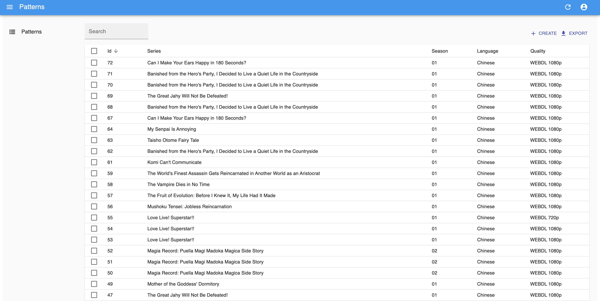
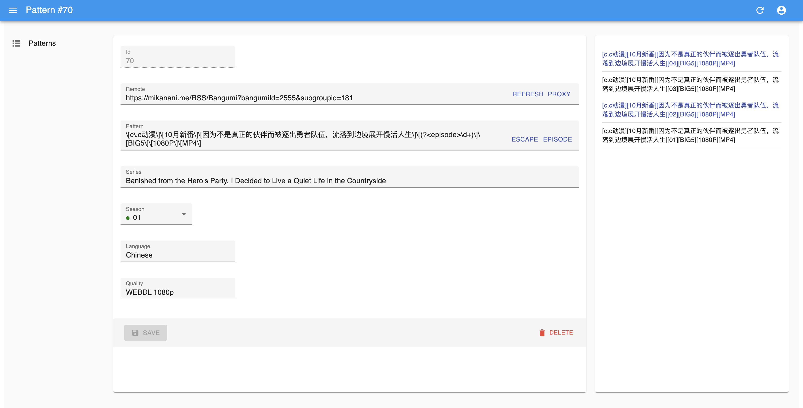

# Nyaarr

[](https://github.com/zx900930/nyaarr/actions/workflows/main.yml)

*Nyaarr* is a bridge between *Nyaa Anime* and *Sonarr*, playing an important role to convert the anime release titles to normalized sonarr format.

This document only describes how to use the project.

## Introduction

[Sonarr](https://sonarr.tv/) based on RSS feeds to find releases (*Release*) that meet your needs and download them, It identifies the corresponding episodes, languages, and formats based on the title (*Title*) of the RSS feed. However, the identification algorithm and episode mapping is not perfect and cant be customized, especially for Japanese animation translation, which is poorly standardized. Therefore, we rewrite the titles to ensure that it can be correctly recognized by Sonarr.

This process requires the user to provide the template format of the title and the corresponding language and media format information. In order to facilitate management, we provide a simple front-end/back-end system.

## Use

First you need a functioning and accessible Sonarr instance, and [get the API Key](https://github.com/Sonarr/Sonarr/wiki/API).

Next, create the `.env` file:

```env
SONARR_API_KEY=aaaabbbbccccddddeeeeffff1145141919810
SONARR_HOST=https://sonarr.yourdomain.com
ADMIN_USERNAME=nyaarr
ADMIN_PASSWORD=your_admin_password
BASE_URL=https://nyaa.si
```

`ADMIN_USERNAME` and `ADMIN_PASSWORD` are used to log in to the system, Nyaarr cannot be accessed without logging in.

Then create a jwk key under the data directory:

```bash
ssh-keygen -t rsa -b 4096 -E SHA512 -m PEM -f jwt.key
openssl rsa -in jwt.key -pubout -outform PEM -out jwt.key.pub
```

Then run this project (requires Node.js environment):

```bash
$ yarn build
$ yarn start
```

Will start a server on port `12307`.

At this point, you can visit `http://localhost:12307` to enter the Nyaarr web page:



In the web page, you can search, sort, add, delete, and edit items. The main fields that need to be filled include:

- `Remote`: Remote address, that is, the RSS feed address of Nyaa Anime, optional.
- `Pattern`: title template, only items matching at least one item will be returned, the template itself is a [regular expression](https://en.wikipedia.org/wiki/Regular_expression), the expression needs to contain [name capture Groups](https://developer.mozilla.org/en-US/docs/Web/JavaScript/Guide/Regular_Expressions/Groups_and_Ranges) (i.e. `(?<episode>\d+)` ) for episode information.
- `Series`: series name, the web page will get all series names from Sonarr, if the desired series is not found, you may need to add the series in Sonarr first.
- `Season`: Season code, the web side will get all seasons from Sonarr and display their monitoring status.
- `Language`: language, which is the English name of the language corresponding to the episode, such as `Chinese`, which needs to meet the language settings required by the series, otherwise it cannot be captured by Sonarr.
- `Quality`: quality, available values ​​can refer to [Sonarr source code](https://github.com/Sonarr/Sonarr/blob/develop/src/NzbDrone.Core/Parser/QualityParser.cs), Sonarr doesn't seem to support it The quality of the items pushed by RSS is automatically detected, and the default value on the web page is `WEBDL 1080p`.

In create and edit pages, the sidebar will automatically fetch the items in the RSS feed based on the address in the *Remote* field, and highlight the items that match the template:



Note that the content of `Pattern` is **regular expression**, and the common `[]` in the seed title is a special character in the regular expression, which needs to be escaped, you can click the ESCAPE button after the input box Quickly escape the contents of the input box, or click the EPISODE button to quickly copy the episode's regex rule.

For example, if the episode title you want to grab is:

````
[Lilith-Raws] If Ultimate Evolved Fully Immersive RPGs Are More Like Junk Games Than Reality / Full Dive - 03 [Baha][WEB-DL][1080p][AVC AAC][CHT][MP4]
````

Paste it into the input box and hit ESCAPE, you will get:

````
\[Lilith-Raws\] If Ultimate Evolution's fully immersive RPG is more of a trash game than reality/ Full Dive - 03 \[Baha\]\[WEB-DL\]\[1080p\]\[AVC AAC\ ]\[CHT\]\[MP4\]
````

Then click EPISODE , replace the `03` in the box with the copied content, and get:

````
\[Lilith-Raws\] If Ultimate Evolution's fully immersive RPG is more of a garbage game than reality/ Full Dive - (?<episode>\d+) \[Baha\]\[WEB-DL\]\[1080p \]\[AVC AAC\]\[CHT\]\[MP4\]
````

Fill in the other fields correctly, and you have completed editing a grab template.

Of course, a more convenient method is to find the corresponding RSS feed on Nyaa Anime, fill in the *Remote* field, and select the desired entry in the sidebar to complete the first two steps.

---

To get the transformed RSS feed, you can replace the domain name part of Nyaa Anime (`nyaa.si`) directly with the domain name deployed by Nyaarr, for example from:

````
https://nyaa.si/?page=rss&c=1_3&f=0
````

get:

````
https://<Nyaarr domain name>/RSS/?page=rss&c=1_3&f=0
````

Add this address to Sonarr and it will automatically grab the episodes you want, cool?

If you fill in the *Remote* field, you can also click the *PROXY* button to copy it with one click.

## Other

### Deployment

You can deploy using [Docker](https://www.docker.com/), our Docker Image is at [`triatk/nyaarr`](https://hub.docker.com/r/triatk/nyaarr) .

The resulting image does not contain a `.env` file, you need to put it in the `data/` folder below.

Also, data files should not be included in Docker Image and Docker Container, you should mount the data folder `data/` from the host to `/data` in the container.

If you use `docker-compose` , here is a `docker-compose.yml` template:

````yaml
version: "3"

services:
  nyaarr:
    image: triatk/nyaarr
    volumes:
      - /path/on/host/data:/data
    environment:
      - PUID=1000
      - PGID=100
    expose:
      - 12307/tcp
    restart: unless-stopped
````

This will start the application using the same `.env` file.

### Safety

- Paths starting with `/RSS` will be used to convert RSS feeds.
- `/proxy` is used to allow the front end to request Nyaa Anime's RSS feed, only URLs under the `https://nyaa.si` domain name are allowed to be requested.
- `/sonarr` is used to reverse the request to the Sonarr API to avoid the client saving the API Key.
- Paths starting with `/api` are used to access and manipulate data.
- Other addresses will get the corresponding static files under `build/`, if not found, it will get `index.html` . Since the frontend uses the Hash Router, all frontend HTML requests should only access the `/` path.

Considering the simplicity of implementation, we do not have access control on the server, you can add access control based on the above description, such as [HTTP Basic Auth](https://developer.mozilla.org/en-US/docs/ Web/HTTP/Authentication). The path under `/?page=rss` needs to be accessed by Sonarr, HTTP Auth cannot be used, and user data will not be directly exposed, so no access control can be considered.

### Development

We use the same `package.json` to cover both front-end and back-end code, which is not good practice, but convenient.

Beyond that, the following files make up a basic [`create-react-app`](https://create-react-app.dev/) application:

````
src/
public/
build/ (build gets)
````

The following files are only used by the backend code:

````
server/
data/ (data file)
.env (configuration file)
````

For front-end development, you can use `yarn dev:web` , which uses `react-scripts dev` to start a Dev Server locally.

In order to access the backend API, front-end development requires a running backend server, you can use `yarn dev:server` or directly `yarn start` to start one. We assume that the backend address for development is `http://localhost:12307` , you can also change the `proxy` field in `package.json` to change.

`yarn dev:server` is also used to develop backend code. It will use [`nodemon`](https://nodemon.io/) to listen to files in `server/` and automatically restart the server when the file changes. A running instance of the frontend is not required to develop the backend.

After the build is completed, the back-end server will serve the front-end code directly, and then only `yarn start` is needed to start one copy.

## Author

Xavier Xiong - [Homepage](https://github.com/zx900930)

张海川 - Haichuan Zhang - [me@std4453.com](mailto:me@std4453.com) - [Homepage](https://blog.std4453.com:444)
